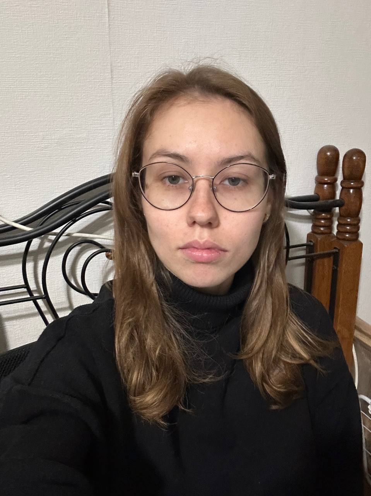
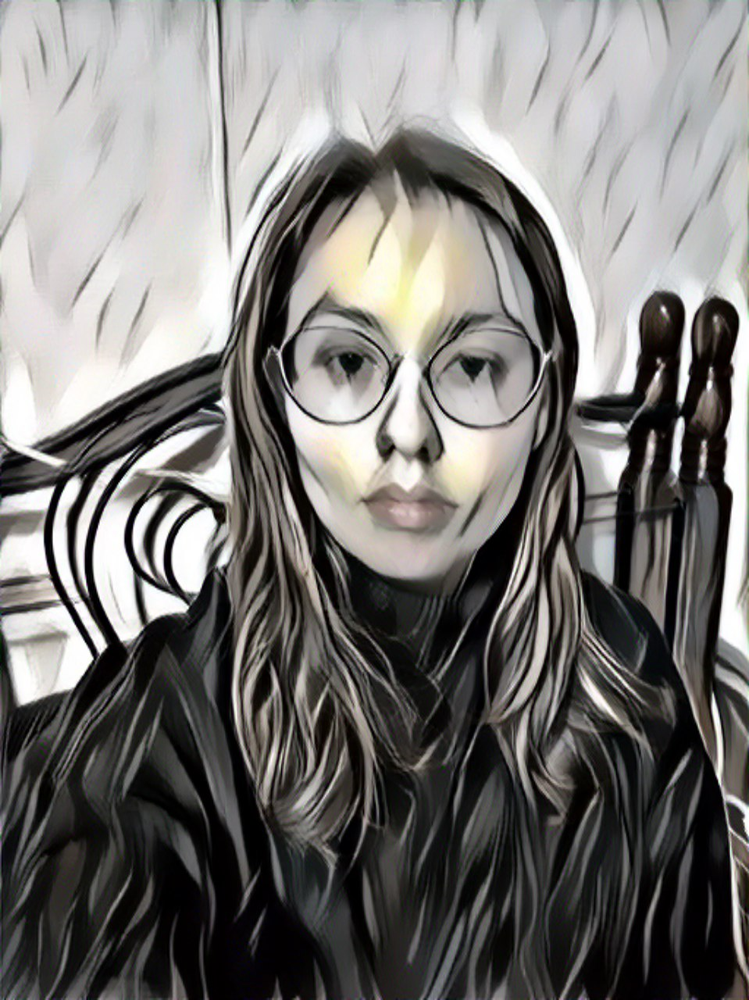

# N
## About

Welcome to our project, a Telegram bot designed for style transfer using neural networks. This bot, powered by the [Neural-Style algorithm](https://arxiv.org/abs/1508.06576 'link to article') by Gatys, Ecker, and Bethge, operates on a CPU server and leverages asynchronous programming to handle multiple requests simultaneously. Users can watch their images transform in real-time, with the option to adjust parameters affecting the style change. 

## Style Transfer Exemples

| Style | Content | Result |
|-------|---------|--------|

|  |  |  |
|  |  |  |
|  |  |  |

## Bot prewier 

The bot is designed to efficiently handle interactions with multiple users simultaneously. Basic communication go through the commands. To initiate the style transfer process, users are required to **upload their style and content images**, using the respective commands designated for this purpose. Additionally, for those looking for a quick start, the bot offers the option to utilize **default images**, facilitating an easier and more immediate entry into the experience.

Once the images are uploaded, the bot is ready to begin the style transfer process. With the **/transfer** command, the training process of the image kicks off. Every 20 epochs, users can observe how the CONTENT image progressively changes its style. Before the training starts, users have the option to **configure some trainig options**. Via an inline keyboard, users choose how many epochs their image will undergo training for and at what resolution. However, it's important to remember "quality equals time"


## Usage

The primary modules used include:

* **aiogram** for bot development
* **torch** and **numpy** for neural network operations
* The pre-trained vgg19 model from **torchvision**

all modules see in requirements.txt

### Running the Project

Follow these instructions to set up and run the project:

1. Create a Telegram bot through [@BotFather](https://t.me/BotFather 'link to telegram') in Telegram and remember your bot token.

2. Clone the repository:
```bash
git clone git@github.com:borolya/tg_ml_bot.git
cd tg_ml_bot
```

3. Create a **.env** file with your bot token. Use **.env.example** as a template for the **.env** file.
```
echo "TOKEN_BOT=<YOUR TOKEN>" > .env
```

4. Install all modules from requirements.txt in a virtual environment:
```bash
python3 -m venv venv
source venv/bin/activate
pip install -r requirements.txt
```

5. And start the bot!
```bash
python3 app.py
```
## 

